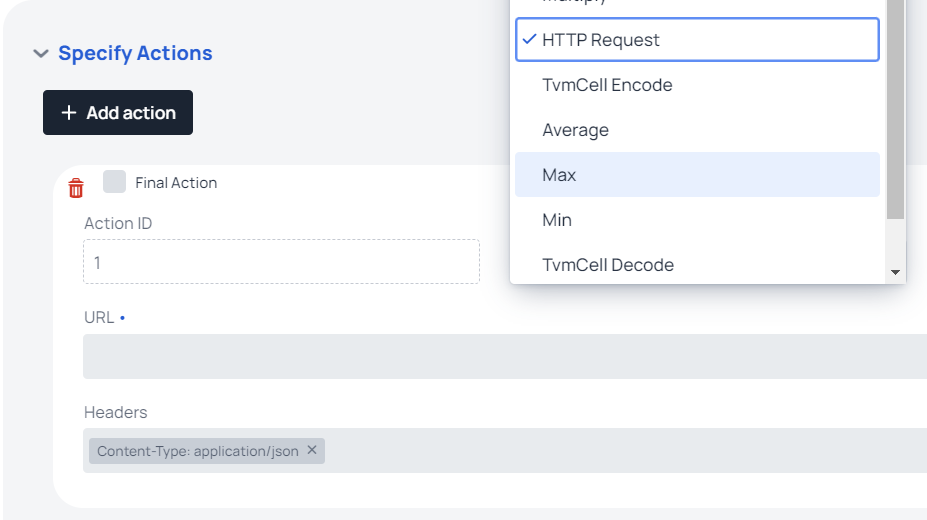

# Task Designer UI

### Describe a Task

<figure><figcaption>
Describe Task Block
</figcaption></figure>

* **Name** - Specify a name for a task that you desire.&#x20;
* **ExternalID** -  it's a param for external systems that can be helpful to match tasks with some foreign registers. Just leave it blank if you don't need it.
* **Import Button** - you can import previously downloaded task JSON. This action will reset your current changes.

### Choice of Consensus

<figure><figcaption>
Choose a Consensus Block
</figcaption></figure>

* **Consensus** - Specify which Consensus do you prefer:
  * **Exact Match** (Precise) - all Validators should accept exactly the same answer
  * **Medianized** - Validators will choose [Average Median](https://en.wikipedia.org/wiki/Median) answer
* **Minimum Validators** - how much Validator answers should be accepted to view your task as successfully completed
* **Maximum Fee** - how much funds each requester should pay for getting answer from this task.

### Choice of Trigger

<figure><figcaption>
Choose a Trigger Block
</figcaption></figure>

* **Trigger** - It's the most important choice that you should take:
  * **On Request** - it means that each request to this **Task** will trigger a new elections between validators and they will provide fresh answer. Also, this means that it's a blocking task that works on the requester until the **Oracle Answer** will be provided, then **Task** will be unblocked. This type of trigger is mostly useful as non-public tasks that work with the only **Consumer**.
  * **On Schedule** - this trigger will provide fresh answers when schedule conditions are met and send its **Oracle Answer** to all subscribed **Consumers**.
  * **Data Feed** - most popular type for public Tasks. **Data Feeds** are constantly monitored **Tasks** that are updated by **Validators** when their new answers deviate too much from previous ones.

### Choice of Actions

<figure><figcaption>
Specify Actions Block
</figcaption></figure>

Each Task is a sequence of Actions ( in fact, it's [Directed Acyclic Graph](https://en.wikipedia.org/wiki/Directed\_acyclic\_graph) ). In this block you should specify a graph of separate atomic Actions that depend on each other. For example, you get requests from different URLs (with **HTTP Request** action), then parse prices from JSON responses with **JSON Parse** action, then aggregate prices with math functions (**Min**, **Max**, **Median** and so on).

Each Action consists of:

* **Final Action Checkbox** - set this on only on your final Action that will be **Oracle Answer**. For **Exact Match** consensus type, your final Action should be of **TvmCellEncode** type, as it can incorporate single or even multiple answers. For **Medianized** consensus type, use math operations as **Final Action**.
* **Action ID** - this is draggable field. **Drag\&Drop** it to any input field in any other Actions params to make a reference to this **Action**.
* **Action Type** - this is a choice of what this action will do, check Task Actions page for info on all types of actions.

